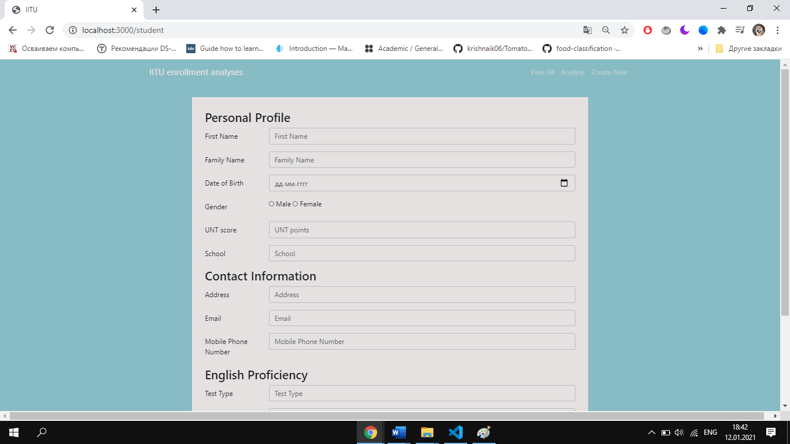

# The-Storage-of-analysis-of-enrollment
Storage will collect applicant personal data, such as name, date of birth, address, English proficiency test type and test score. The Database will help students with choosing right specialization based on their Unified National Testing score and other parameters

